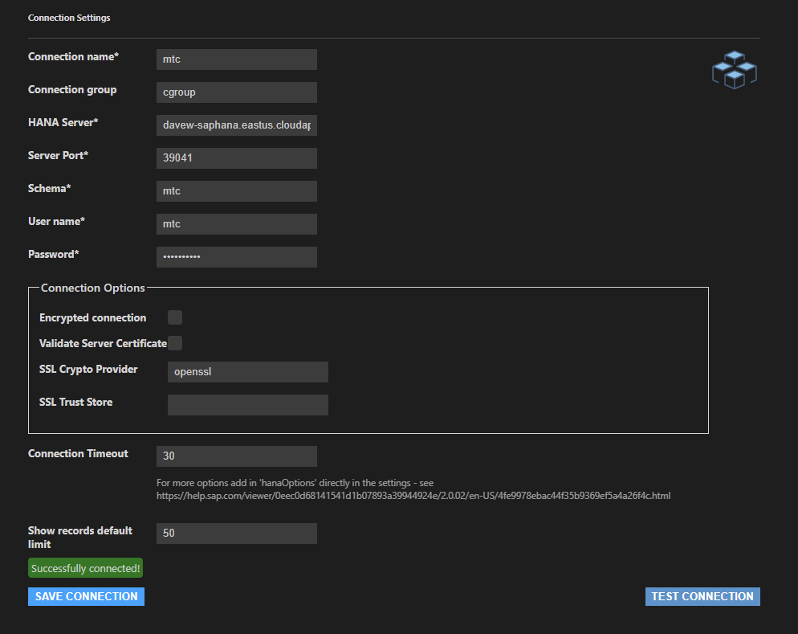

* [setup steps](./SAPHANA-setup.md)

## Connecting

azure sub:  davew-shared
rg:  davew-saphana.eastus.cloudapp.azure.com

server:  davew-saphana.
vm login:  hana/Password01!!

connecting:  
(jit is enabled, need to maybe fix that)
ssh hana@davew-saphana.eastus.cloudapp.azure.com

nsg rules changed to allow 39017 and 39041 (priority 2711)

SYSTEM pwd:  adfADFADFer4545!!!
## from jdbc:  
jdbc:sap://davew-saphana.eastus.cloudapp.azure.com:39017/?databaseName=SYSTEMDB
jdbc:sap://davew-saphana.eastus.cloudapp.azure.com:39041/?databaseName=HXE

## from vscode:
extension:  sap hana driver for SQLTools
click SQLTools on the left

## ...or install hana studio
you can use my sapid

## sample queries
select * from "SYS"."M_DATABASES"
select * from tables

CREATE SCHEMA MTC;

CREATE	 COLUMN TABLE MTC.FooBar
(        ELEMENT CHAR(1),			
       PRIMARY KEY (ELEMENT)
);			
INSERT INTO MTC.FooBar VALUES ('F');
INSERT INTO MTC.FooBar VALUES ('U');			
INSERT INTO MTC.FooBar VALUES ('B');			
INSERT	INTO MTC.FooBar VALUES ('A');			
INSERT	INTO MTC.FooBar VALUES ('R');

select * from MTC.Foobar